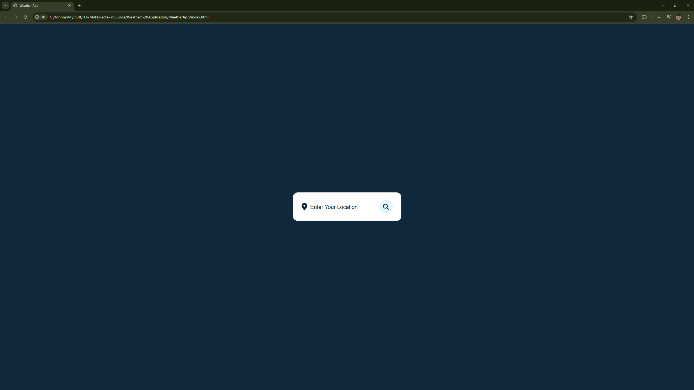
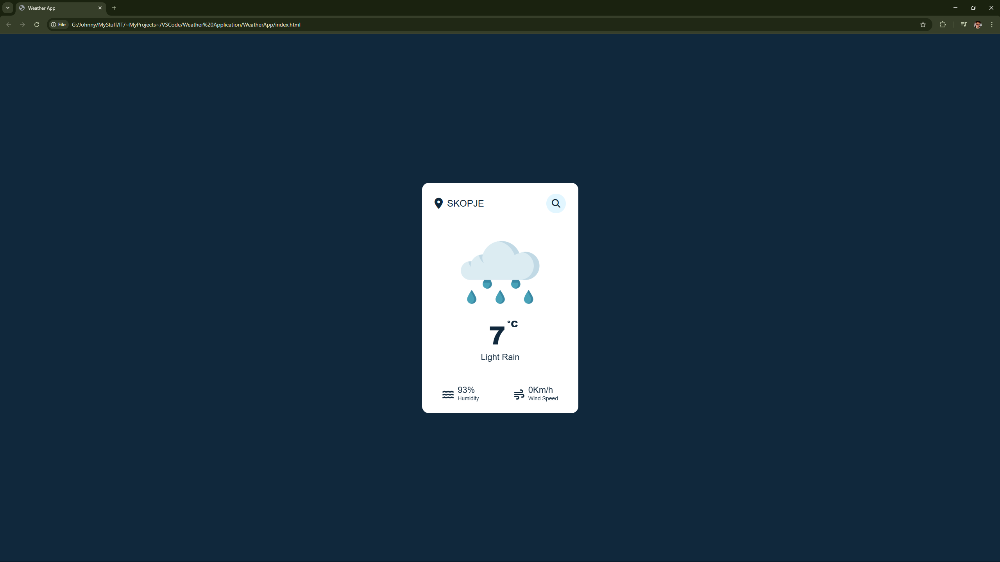
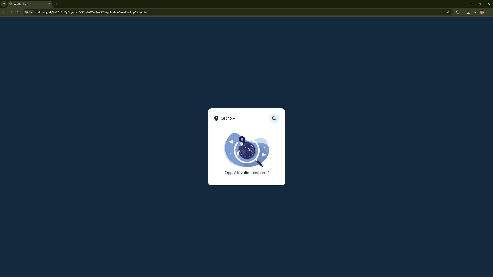

#Weather Application

This is a simple weather web application built with HTML, CSS, and vanilla JavaScript that lets you search for any city and instantly view the current weather conditions.
The app fetches real‑time weather data from a weather API, displays temperature, description, and location, and includes a responsive, minimal UI with clean animations and error handling for invalid cities.

---

## 🚀 Features

- **City Search:** Enter any city and get instant weather information.
- **Real‑Time Weather:** Display current temperature, description, and location.
- **Responsive UI:** Works smoothly on both desktop and mobile devices.
- **Error Handling:** Shows a friendly message when a city is not found.

---

## 🛠️ Tech Stack

- **Frontend:** HTML5, CSS3, Vanilla JavaScript
- **Weather Data:** Third‑party Weather API (e.g., OpenWeatherMap)

---

## 📦 Project Structure

- **weather-app/
- **├── index.html
- **├── script.js
- **└── style.css
  
---

## ⚙️ Installation & Setup

1. **Clone the repository:**

  ```
  git clone https://github.com/your-username/weather-app.git
  cd weather-app
  ```
2. **Add your API key (if required):**

 - Edit `script.js` and replace the placeholder API key with your own (e.g., from OpenWeatherMap):
  ```
  const API_KEY = "your_api_key_here";
  ```
3. **Run the app locally:**

 - Open `index.htm` in a browser, or serve it through a local server:
  ```
  npx serve
  ```
(default: http://localhost:5000)

---

## 📋 Usage

- Type a city name in the search box and press Enter.
- The app will fetch the current weather data and display temperature, description, and location.
- If the city is not found, a clear “not found” message will appear.

---

## 📸 Screenshots

### Home Page


### Weather Display


### Error State


---

> **Created and maintained by [Gjorgi Stamkov](https://github.com/gjorgistamkov).**
> 
